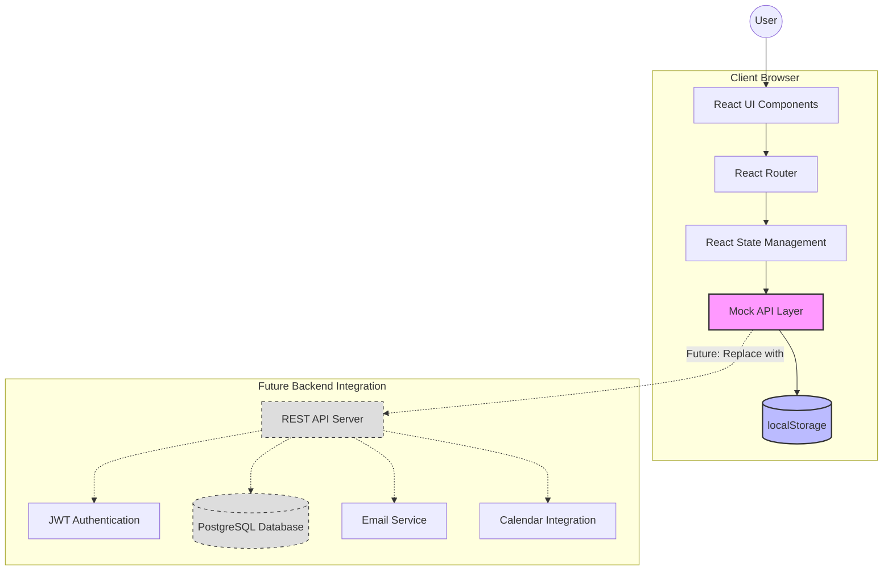
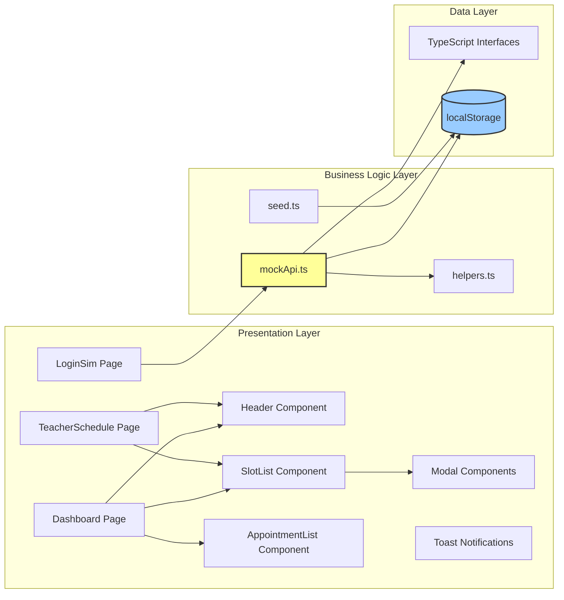
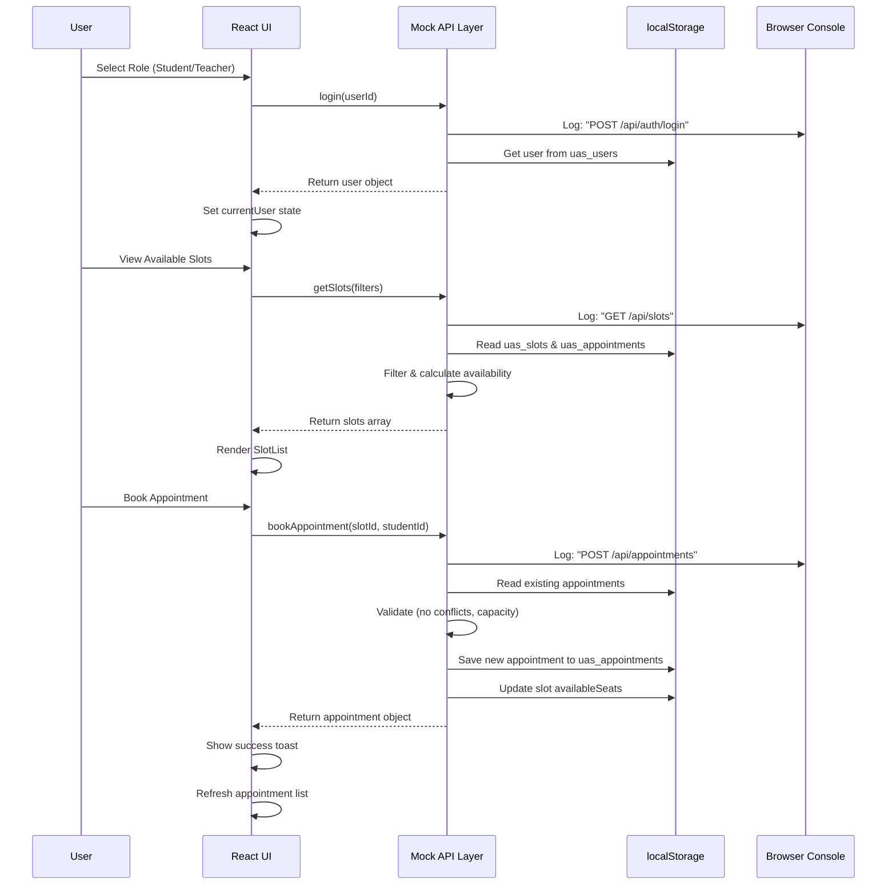
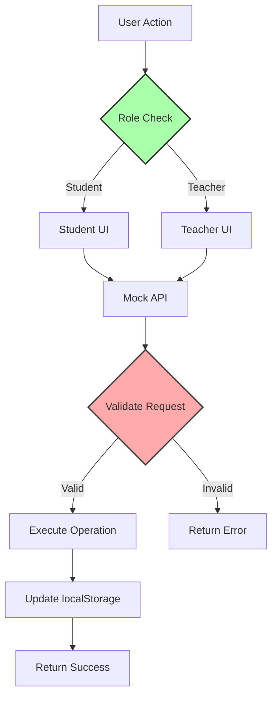
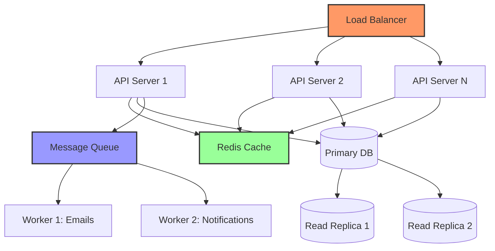
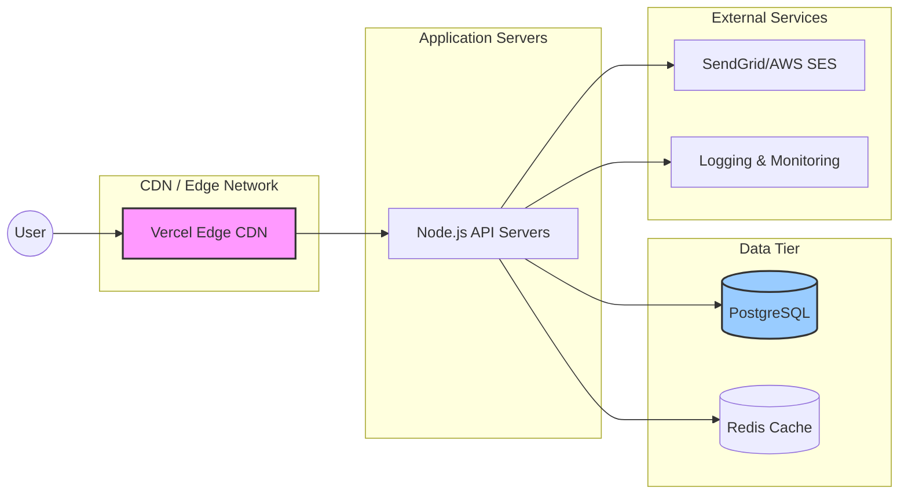

# System Architecture

## Architecture Overview

The University Appointment Scheduler follows a **client-side MVP architecture** with simulated backend operations using localStorage. This design allows for rapid prototyping while maintaining a clear separation of concerns that can easily transition to a full client-server architecture.

---

## High-Level Architecture Diagram



---

## Detailed Component Architecture



---

## Data Flow Diagram



---

## Component Descriptions

### Presentation Layer

**Pages:**

- **LoginSim.tsx**: Mock authentication interface allowing users to select a role (Student/Teacher) without passwords. Sets currentUser in localStorage.
- **Dashboard.tsx**: Student view showing available appointment slots, booked appointments, and booking actions.
- **TeacherSchedule.tsx**: Teacher view for creating/editing time slots, viewing bookings, and managing availability.

**Components:**

- **Header.tsx**: Navigation bar with app title, current user info, and logout button.
- **SlotList.tsx**: Reusable component displaying time slots as cards with actions (book for students, edit for teachers).
- **AppointmentList.tsx**: Lists user's appointments with status badges and cancellation options.
- **SlotModal.tsx**: Form modal for teachers to create/edit appointment slots.
- **BookModal.tsx**: Confirmation modal for students booking appointments.
- **Toast.tsx**: Notification component for success/error messages.

### Business Logic Layer

**mockApi.ts**: Core API simulation layer that:

- Wraps all data operations in Promises with realistic delays (300-700ms)
- Logs all operations to console as if they were network requests
- Implements business rules (validation, conflict detection, capacity checks)
- Uses localStorage as persistent data store
- Provides functions matching REST API patterns

**Key Functions:**

```typescript
- login(userId): Authenticate user
- getSlots(filters): Retrieve filtered slots
- getSlotById(id): Get single slot details
- createSlot(slotData): Teacher creates new slot
- updateSlot(id, updates): Teacher modifies slot
- deleteSlot(id): Teacher removes slot
- bookAppointment(slotId, studentId): Student books slot
- cancelAppointment(id): Cancel booking (policy check)
- getUserAppointments(userId): Get user's appointments
- getSlotAppointments(slotId): Get all bookings for a slot
```

**helpers.ts**: Utility functions:

- `uid()`: Generate unique IDs
- `formatDate()`: Format ISO strings to readable dates
- `formatTime()`: Extract time from ISO strings
- `isWithinCancellationWindow()`: Check 24-hour policy
- `slotsOverlap()`: Detect scheduling conflicts

**seed.ts**: Initial data population:

- Creates sample students and teachers
- Seeds appointment slots for the next 2 weeks
- Runs automatically if localStorage is empty

### Data Layer

**types/index.ts**: TypeScript interfaces defining data structures:

```typescript
export interface User {
  id: string;
  name: string;
  role: "STUDENT" | "TEACHER";
  email: string;
  phone?: string;
}

export interface Slot {
  id: string;
  teacherId: string;
  startISO: string;
  endISO: string;
  location: string;
  maxSeats: number;
  availableSeats: number;
}

export interface Appointment {
  id: string;
  slotId: string;
  studentId: string;
  status: "BOOKED" | "CANCELLED" | "ATTENDED";
  notes?: string;
  createdAt: string;
  cancelledAt?: string;
}
```

**localStorage Schema**:

- `uas_users`: Array of User objects
- `uas_slots`: Array of Slot objects
- `uas_appointments`: Array of Appointment objects
- `uas_currentUser`: Currently logged-in user object

---

## Security Architecture (MVP Limitations)



**Current MVP Security:**

- ✅ Role-based UI rendering (students can't see teacher features)
- ✅ Client-side validation in mockApi functions
- ✅ Ownership checks (users can only modify their own data)
- ❌ No encryption (localStorage is plain JSON)
- ❌ No real authentication (role selection without passwords)
- ❌ No authorization on "backend" (all logic client-side)

**Production Security Requirements:**

- JWT-based authentication with httpOnly cookies
- Server-side authorization middleware on every endpoint
- Password hashing with bcrypt (cost factor 12+)
- Rate limiting on authentication endpoints
- HTTPS/TLS for all communications
- Database-level access controls
- Audit logging of all sensitive operations

---

## Scalability Considerations

### Current MVP Limitations:

- **Single User**: localStorage is browser-specific (no multi-user coordination)
- **Storage Limit**: ~5-10MB localStorage cap
- **No Real-Time Updates**: Changes don't sync across tabs/devices
- **Client-Side Only**: All logic runs in browser (performance depends on device)

### Production Scaling Strategy:



**Horizontal Scaling:**

- Multiple API server instances behind load balancer
- Database read replicas for slot queries
- Redis cache for frequently accessed data (available slots)
- Message queue for async tasks (emails, notifications)

**Database Optimization:**

- Indexes on foreign keys and query filters
- Partitioning appointments table by date (archive old data)
- Connection pooling to handle concurrent requests

---

## Technology Stack Summary

| Layer                  | Technology               | Purpose                                        |
| ---------------------- | ------------------------ | ---------------------------------------------- |
| **Frontend Framework** | React 18 + TypeScript    | Component-based UI with type safety            |
| **Build Tool**         | Vite 5                   | Fast development server and optimized builds   |
| **Styling**            | Tailwind CSS 3           | Utility-first CSS for rapid UI development     |
| **Routing**            | React Router (future)    | Client-side navigation (to be added)           |
| **State Management**   | React useState/useEffect | Local component state (Context API for future) |
| **Mock Backend**       | Custom mockApi.ts        | Simulates REST API with localStorage           |
| **Storage**            | Browser localStorage     | Persistent data store for MVP                  |
| **Type Checking**      | TypeScript 5.3           | Compile-time type safety                       |
| **Linting**            | ESLint                   | Code quality enforcement                       |
| **Version Control**    | Git                      | Source code management                         |

**Future Stack Additions:**

- **Backend**: Node.js + Express + TypeScript
- **Database**: PostgreSQL + Prisma ORM
- **Authentication**: JWT + bcrypt
- **API Testing**: Jest + Supertest
- **Deployment**: Vercel (frontend) + Railway (backend)

---

## Deployment Architecture (Future Production)



**Frontend Deployment:**

- Static assets served from CDN (Vercel/Netlify)
- Automatic HTTPS with certificate management
- Global edge locations for low latency

**Backend Deployment:**

- Containerized with Docker for consistency
- Auto-scaling based on CPU/memory usage
- Health checks and automatic restarts
- Environment-based configuration (dev/staging/prod)

**Database Deployment:**

- Managed PostgreSQL service (Railway/Supabase)
- Automated backups (daily, retained 30 days)
- Point-in-time recovery capability
- SSL-encrypted connections

---

## Migration Path from MVP to Production

### Phase 1: Backend Setup (Weeks 1-2)

1. Set up Node.js + Express server
2. Implement PostgreSQL database with Prisma
3. Create REST API endpoints matching mockApi functions
4. Add JWT authentication
5. Deploy backend to Railway/Render

### Phase 2: Frontend Integration (Week 3)

1. Replace mockApi calls with fetch() to real API
2. Implement token storage and refresh logic
3. Add loading states and error boundaries
4. Test with production backend

### Phase 3: Production Features (Week 4+)

1. Email notifications (SendGrid integration)
2. Calendar sync (Google Calendar API)
3. Admin dashboard
4. Analytics and reporting

**Code Changes Required:**

```typescript
// Before (MVP):
import { getSlots } from "./lib/mockApi";
const slots = await getSlots({ available: true });

// After (Production):
const response = await fetch("/api/slots?available=true", {
  headers: { Authorization: `Bearer ${token}` },
});
const { data } = await response.json();
const slots = data.slots;
```

Most business logic in mockApi.ts translates directly to backend route handlers with minimal changes.

---

## Mapping to Task 4 Rubric

| Rubric Item                        | Coverage in This Document                                        |
| ---------------------------------- | ---------------------------------------------------------------- |
| **Architecture Diagram (Mermaid)** | ✅ Multiple diagrams: High-level, Component, Data Flow, Security |
| **Component Description**          | ✅ Detailed descriptions of all layers and components            |
| **Technology Stack Explanation**   | ✅ Complete stack with purpose for each technology               |
| **Data Flow Visualization**        | ✅ Sequence diagram showing booking flow                         |
| **Scalability Considerations**     | ✅ Current limitations and production scaling strategy           |
| **Security Architecture**          | ✅ Current state and production requirements                     |
| **Deployment Strategy**            | ✅ Future production deployment architecture                     |

---

## Appendix: localStorage Schema Examples

**uas_users:**

```json
[
  {
    "id": "student1",
    "name": "Alice Johnson",
    "role": "STUDENT",
    "email": "alice.johnson@university.edu",
    "phone": "+1-555-0101"
  },
  {
    "id": "teacher1",
    "name": "Dr. Robert Smith",
    "role": "TEACHER",
    "email": "robert.smith@university.edu",
    "phone": "+1-555-0201"
  }
]
```

**uas_slots:**

```json
[
  {
    "id": "slot1",
    "teacherId": "teacher1",
    "startISO": "2025-11-25T10:00:00.000Z",
    "endISO": "2025-11-25T11:00:00.000Z",
    "location": "Room 301, Engineering Building",
    "maxSeats": 1,
    "availableSeats": 1
  }
]
```

**uas_appointments:**

```json
[
  {
    "id": "appt1",
    "slotId": "slot1",
    "studentId": "student1",
    "status": "BOOKED",
    "notes": "Discuss final project",
    "createdAt": "2025-11-24T15:30:00.000Z"
  }
]
```
