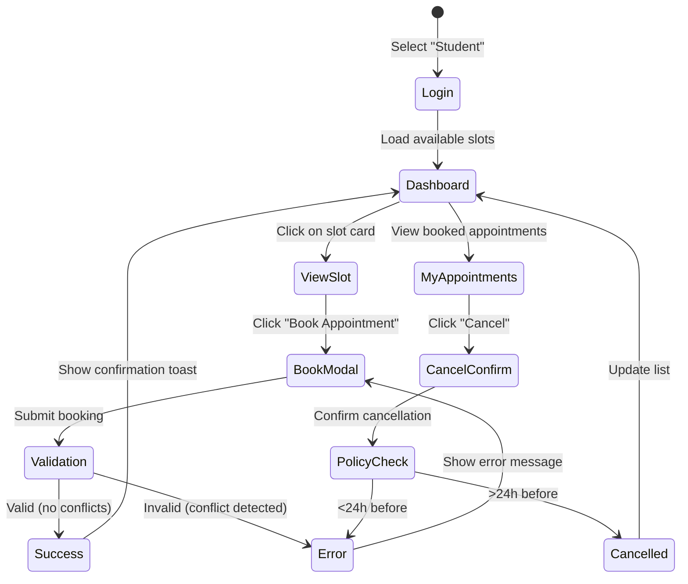
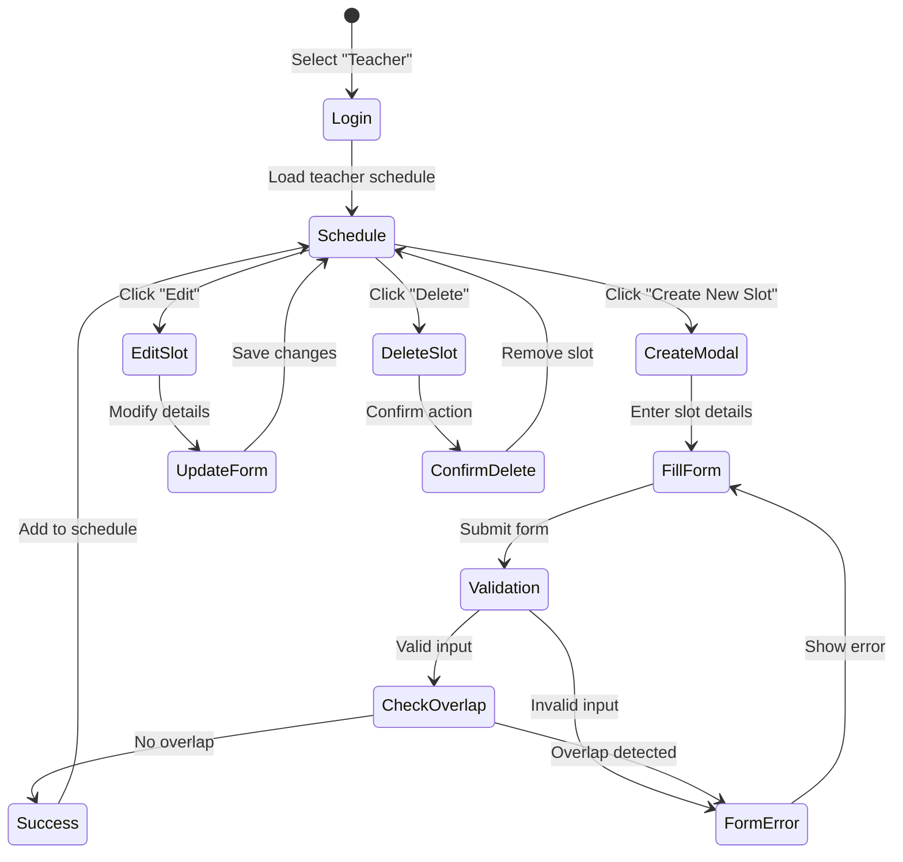

# Wireframes & UX Design

## Overview

This document presents wireframes for the University Appointment Scheduler's key user interfaces. The design follows a mobile-first, accessible approach using clean layouts and intuitive navigation patterns.

---

## Wireframe 1: Student Dashboard

### Layout Diagram (Mermaid)

```mermaid
graph TD
    subgraph Header
        Logo[🎓 University Scheduler]
        UserInfo[👤 Alice Johnson - Student]
        LogoutBtn[Logout]
    end

    subgraph MainContent["Main Content Area"]
        Title[Available Appointment Slots]
        Filters[Filter: Date Range | Teacher | Subject]

        subgraph SlotCard1["Slot Card 1"]
            SC1Time[📅 Mon, Nov 25 • 10:00 AM - 11:00 AM]
            SC1Teacher[👨‍🏫 Dr. Robert Smith]
            SC1Location[📍 Room 301, Engineering Bldg]
            SC1Seats[💺 1 seat available]
            SC1BookBtn[Book Appointment →]
        end

        subgraph SlotCard2["Slot Card 2"]
            SC2Time[📅 Mon, Nov 25 • 2:00 PM - 3:00 PM]
            SC2Teacher[👩‍🏫 Prof. Emily Chen]
            SC2Location[📍 Room 205, Science Hall]
            SC2Seats[💺 2 seats available]
            SC2BookBtn2[Book Appointment →]
        end

        subgraph MyAppointments["My Appointments Section"]
            MATitle[Your Upcoming Appointments]

            subgraph ApptCard["Appointment Card"]
                ApptTime[📅 Tue, Nov 26 • 11:00 AM]
                ApptTeacher[With: Dr. Robert Smith]
                ApptLocation[📍 Room 301]
                ApptStatus[✅ CONFIRMED]
                CancelBtn[❌ Cancel <disabled if <24h>]
            end
        end
    end

    Header --> MainContent
```

### ASCII Art Version

```
╔════════════════════════════════════════════════════════════╗
║  🎓 University Appointment Scheduler                       ║
║                          👤 Alice Johnson (Student) [Logout]║
╚════════════════════════════════════════════════════════════╝

┌────────────────────────────────────────────────────────────┐
│  📅 Available Appointment Slots                            │
├────────────────────────────────────────────────────────────┤
│  🔍 Filter:  [Date Range ▼] [Teacher ▼] [Subject ▼]      │
└────────────────────────────────────────────────────────────┘

┌──────────────────────────────────────────────────────────┐
│ 📅 Monday, November 25, 2025                             │
│ ⏰ 10:00 AM - 11:00 AM                                   │
│                                                          │
│ 👨‍🏫 Dr. Robert Smith - Computer Science                  │
│ 📍 Room 301, Engineering Building                        │
│ 💺 1 of 1 seats available                                │
│                                                          │
│                          [  Book Appointment →  ]        │
└──────────────────────────────────────────────────────────┘

┌──────────────────────────────────────────────────────────┐
│ 📅 Monday, November 25, 2025                             │
│ ⏰ 2:00 PM - 3:00 PM                                     │
│                                                          │
│ 👩‍🏫 Prof. Emily Chen - Mathematics                       │
│ 📍 Room 205, Science Hall                                │
│ 💺 2 of 3 seats available                                │
│                                                          │
│                          [  Book Appointment →  ]        │
└──────────────────────────────────────────────────────────┘

┌──────────────────────────────────────────────────────────┐
│  📋 Your Upcoming Appointments                           │
├──────────────────────────────────────────────────────────┤
│                                                          │
│  📅 Tuesday, November 26, 2025 • 11:00 AM               │
│  👨‍🏫 With: Dr. Robert Smith                              │
│  📍 Room 301, Engineering Building                       │
│  ✅ Status: CONFIRMED                                    │
│  📝 Notes: Discuss final project proposal                │
│                                                          │
│  [  ❌ Cancel Appointment  ]  (Available until Nov 25)   │
│                                                          │
├──────────────────────────────────────────────────────────┤
│  No more upcoming appointments                           │
└──────────────────────────────────────────────────────────┘
```

### UX Design Decisions

**1. Card-Based Layout:**

- **Why:** Cards provide clear visual separation between different appointment slots
- **Benefit:** Easy to scan multiple options quickly
- **Accessibility:** Each card is a semantic `<article>` element with proper ARIA labels

**2. Icon System:**

- **Why:** Visual icons (calendar, location, person) reduce cognitive load
- **Benefit:** International users can understand interface faster
- **Implementation:** Inline SVG icons with descriptive `aria-label` attributes

**3. Prominent Call-to-Action:**

- **Why:** "Book Appointment" button uses high contrast primary color
- **Benefit:** Clear what action user should take
- **Accessibility:** Minimum 4.5:1 contrast ratio, focus visible with keyboard navigation

**4. Status Indicators:**

- **Why:** Color-coded badges (✅ Confirmed, ⏳ Pending, ❌ Cancelled) provide at-a-glance status
- **Benefit:** Users quickly understand appointment state without reading text
- **Accessibility:** Icons paired with text (not color alone)

**5. Contextual Actions:**

- **Why:** Cancel button only enabled if >24 hours before appointment
- **Benefit:** Enforces business rules visually before API call
- **UX:** Disabled state shows tooltip explaining policy

---

## Wireframe 2: Teacher Schedule Management

### Layout Diagram (Mermaid)

```mermaid
graph TD
    subgraph Header2["Header"]
        Logo2[🎓 University Scheduler]
        UserInfo2[👤 Dr. Robert Smith - Teacher]
        LogoutBtn2[Logout]
    end

    subgraph TeacherContent["Teacher Dashboard"]
        Title2[My Schedule & Appointments]
        ActionBar[+ Create New Slot | 📅 Calendar View | 📊 Reports]

        subgraph UpcomingSlots["Upcoming Slots"]
            SlotTitle[Your Available Slots]

            subgraph TSlot1["Slot Card - Booked"]
                TS1Time[📅 Mon, Nov 25 • 10:00 AM - 11:00 AM]
                TS1Location[📍 Room 301]
                TS1Status[✅ BOOKED - Alice Johnson]
                TS1Actions[View | Mark Attended | Cancel]
            end

            subgraph TSlot2["Slot Card - Available"]
                TS2Time[📅 Mon, Nov 25 • 2:00 PM - 3:00 PM]
                TS2Location[📍 Room 301]
                TS2Status[⚪ AVAILABLE - 0/1 booked]
                TS2Actions[Edit | Delete]
            end
        end

        subgraph CreateSlotForm["Create Slot Modal"]
            FormTitle[Create Appointment Slot]
            FormDate[📅 Date: [________]]
            FormStart[⏰ Start Time: [____]]
            FormEnd[⏰ End Time: [____]]
            FormLocation[📍 Location: [_______]]
            FormCapacity[💺 Max Students: [_]]
            FormButtons[Cancel | Create Slot]
        end
    end

    Header2 --> TeacherContent
```

### ASCII Art Version

```
╔════════════════════════════════════════════════════════════╗
║  🎓 University Appointment Scheduler                       ║
║                      👤 Dr. Robert Smith (Teacher) [Logout]║
╚════════════════════════════════════════════════════════════╝

┌────────────────────────────────────────────────────────────┐
│  📅 My Schedule & Appointments                             │
├────────────────────────────────────────────────────────────┤
│                                                            │
│  [  ➕ Create New Slot  ]  [ 📅 Week View ]  [ 📊 Stats ] │
│                                                            │
└────────────────────────────────────────────────────────────┘

┌──────────────────────────────────────────────────────────┐
│  📆 Upcoming Slots                                       │
├──────────────────────────────────────────────────────────┤
│                                                          │
│  📅 Monday, November 25, 2025                            │
│  ⏰ 10:00 AM - 11:00 AM                                  │
│  📍 Room 301, Engineering Building                       │
│  ✅ BOOKED                                               │
│                                                          │
│  👤 Student: Alice Johnson                               │
│  📧 alice.johnson@university.edu                         │
│  📝 Notes: "Discuss final project proposal"              │
│                                                          │
│  [  View Details  ]  [  Mark Attended  ]  [  Cancel  ]  │
│                                                          │
├──────────────────────────────────────────────────────────┤
│                                                          │
│  📅 Monday, November 25, 2025                            │
│  ⏰ 2:00 PM - 3:00 PM                                    │
│  📍 Room 301, Engineering Building                       │
│  ⚪ AVAILABLE                                            │
│                                                          │
│  👥 0 of 1 seats booked                                  │
│                                                          │
│  [  Edit Slot  ]              [  Delete Slot  ]         │
│                                                          │
├──────────────────────────────────────────────────────────┤
│                                                          │
│  📅 Tuesday, November 26, 2025                           │
│  ⏰ 11:00 AM - 12:00 PM                                  │
│  📍 Room 301, Engineering Building                       │
│  ⚪ AVAILABLE                                            │
│                                                          │
│  👥 0 of 1 seats booked                                  │
│                                                          │
│  [  Edit Slot  ]              [  Delete Slot  ]         │
│                                                          │
└──────────────────────────────────────────────────────────┘

═══════════════════════════════════════════════════════════
 CREATE NEW APPOINTMENT SLOT                          [✕]
═══════════════════════════════════════════════════════════

  📅 Date *
  ┌─────────────────────────────────────┐
  │  [  2025-11-27  ]  [📅]              │
  └─────────────────────────────────────┘

  ⏰ Start Time *
  ┌─────────────────────────────────────┐
  │  [  10:00 AM  ]  [🕐]                │
  └─────────────────────────────────────┘

  ⏰ End Time *
  ┌─────────────────────────────────────┐
  │  [  11:00 AM  ]  [🕐]                │
  └─────────────────────────────────────┘

  📍 Location *
  ┌─────────────────────────────────────┐
  │  Room 301, Engineering Building     │
  └─────────────────────────────────────┘

  💺 Maximum Students *
  ┌─────────────────────────────────────┐
  │  [ 1 ]  (1-10)                      │
  └─────────────────────────────────────┘

  ─────────────────────────────────────────
  [  Cancel  ]            [  Create Slot  ]

═══════════════════════════════════════════════════════════
```

### UX Design Decisions

**1. Action-Oriented Top Bar:**

- **Why:** Teachers need quick access to create slots and view different layouts
- **Benefit:** Reduces clicks to perform common tasks
- **Implementation:** Fixed position toolbar with primary actions always visible

**2. Dual-State Slot Display:**

- **Why:** Distinguish between booked and available slots at a glance
- **Benefit:** Teachers prioritize attention on booked appointments
- **Design:** Different color schemes (green for booked, gray for available)

**3. Student Information Display:**

- **Why:** Teachers need context about who they're meeting
- **Benefit:** Enables preparation for appointments
- **Privacy:** Only show necessary information (name, email, notes)

**4. Inline Actions:**

- **Why:** Actions like "Mark Attended" are contextual to each appointment
- **Benefit:** Faster than navigating to separate pages
- **Accessibility:** Buttons have descriptive labels and keyboard shortcuts

**5. Modal Form for Slot Creation:**

- **Why:** Focus user attention on single task without navigation
- **Benefit:** Validation feedback immediate without page reload
- **UX:** Form fields validated on blur with helpful error messages

**6. Date/Time Pickers:**

- **Why:** Native HTML5 date/time inputs for consistency
- **Benefit:** Mobile-friendly, respects user's locale settings
- **Fallback:** Custom picker for browsers without native support

---

## Wireframe 3: Login/Role Selection (Mock Auth)

### ASCII Art

```
╔════════════════════════════════════════════════════════════╗
║                                                            ║
║             🎓                                              ║
║        UNIVERSITY                                          ║
║   APPOINTMENT SCHEDULER                                    ║
║                                                            ║
╚════════════════════════════════════════════════════════════╝

┌────────────────────────────────────────────────────────────┐
│                                                            │
│              Welcome! Select Your Role                     │
│                                                            │
│  ┌──────────────────────────────────────────────────┐    │
│  │                                                    │    │
│  │  👨‍🎓 STUDENT                                       │    │
│  │                                                    │    │
│  │  Browse and book appointments with teachers       │    │
│  │                                                    │    │
│  │                      [  Continue as Student  ]    │    │
│  │                                                    │    │
│  └──────────────────────────────────────────────────┘    │
│                                                            │
│  ┌──────────────────────────────────────────────────┐    │
│  │                                                    │    │
│  │  👩‍🏫 TEACHER                                       │    │
│  │                                                    │    │
│  │  Manage your schedule and view bookings          │    │
│  │                                                    │    │
│  │                      [  Continue as Teacher  ]    │    │
│  │                                                    │    │
│  └──────────────────────────────────────────────────┘    │
│                                                            │
│  ⚠️  Demo Mode: No password required                      │
│     Production version will use university SSO            │
│                                                            │
└────────────────────────────────────────────────────────────┘
```

### UX Design Decisions

**1. Clear Role Selection:**

- **Why:** MVP has no real auth, so explicit role choice is needed
- **Benefit:** Users understand they're choosing a persona
- **Design:** Large, distinct cards with role icons and descriptions

**2. Warning Banner:**

- **Why:** Transparency about mock authentication
- **Benefit:** Users know this is a demo/educational project
- **Positioning:** Bottom of screen, low emphasis but visible

**3. Minimal Friction:**

- **Why:** One-click access to explore features
- **Benefit:** Fast onboarding for demo purposes
- **Trade-off:** Zero security (acceptable for MVP)

---

## Responsive Design Strategy

### Mobile Breakpoints

```
Mobile First Approach:

📱 Mobile (< 640px)
  - Single column layout
  - Cards stack vertically
  - Hamburger menu for navigation
  - Touch-friendly buttons (min 44x44px)

📱 Tablet (640px - 1024px)
  - Two-column grid for slot cards
  - Side-by-side filters
  - Expanded navigation

🖥️ Desktop (> 1024px)
  - Three-column grid
  - Sidebar navigation
  - Inline forms instead of modals
  - Hover states on interactive elements
```

### Tailwind CSS Responsive Classes

```typescript
// Example component with responsive design
<div
  className="
  p-4                      // Mobile: 1rem padding
  md:p-6                   // Tablet: 1.5rem padding
  lg:p-8                   // Desktop: 2rem padding
  
  grid grid-cols-1         // Mobile: 1 column
  md:grid-cols-2           // Tablet: 2 columns
  lg:grid-cols-3           // Desktop: 3 columns
  
  gap-4 md:gap-6 lg:gap-8  // Responsive gap
"
>
  {slots.map((slot) => (
    <SlotCard key={slot.id} slot={slot} />
  ))}
</div>
```

---

## Accessibility Features (WCAG 2.1 Level A)

### 1. Keyboard Navigation

- **Tab Order:** Logical flow through interactive elements
- **Focus Indicators:** Visible outline on focused elements (blue ring)
- **Skip Links:** "Skip to main content" for screen readers
- **Shortcuts:** Enter/Space to activate buttons

```css
/* Focus visible styles */
button:focus-visible {
  outline: 2px solid #3b82f6;
  outline-offset: 2px;
}
```

### 2. Screen Reader Support

```tsx
// Example accessible component
<button
  type="button"
  onClick={handleBook}
  aria-label={`Book appointment with ${teacher.name} on ${formatDate(slot.start)}`}
  aria-describedby={`slot-${slot.id}-details`}
>
  Book Appointment
</button>

<div id={`slot-${slot.id}-details`} className="sr-only">
  {slot.availableSeats} of {slot.maxSeats} seats available.
  This appointment is on {formatDate(slot.start)} at {formatTime(slot.start)}.
</div>
```

### 3. Color Contrast

- **Text on Background:** Minimum 4.5:1 ratio
- **Interactive Elements:** Minimum 3:1 ratio
- **Status Indicators:** Not relying on color alone (icons + text)

**Color Palette:**

```
Primary Blue:    #2563eb (contrast ratio 7.5:1 on white)
Success Green:   #10b981 (contrast ratio 4.8:1 on white)
Warning Yellow:  #f59e0b (contrast ratio 3.2:1, use darker for text)
Error Red:       #ef4444 (contrast ratio 5.1:1 on white)
```

### 4. Form Labels & Errors

```tsx
<label htmlFor="slot-location" className="block text-sm font-medium">
  Location <span aria-label="required">*</span>
</label>
<input
  id="slot-location"
  type="text"
  required
  aria-required="true"
  aria-invalid={!!errors.location}
  aria-describedby={errors.location ? "location-error" : undefined}
/>
{errors.location && (
  <p id="location-error" className="text-red-600 text-sm" role="alert">
    {errors.location}
  </p>
)}
```

### 5. Alternative Text

```tsx
// Icon-only buttons with accessible labels
<button aria-label="Delete slot" title="Delete slot">
  <svg aria-hidden="true" className="w-5 h-5">
    {/* Trash icon SVG */}
  </svg>
</button>

// Decorative images hidden from screen readers

```

---

## User Flows

### Student Booking Flow



### Teacher Slot Creation Flow



---

## Design System

### Typography Scale

```css
/* Tailwind utility classes */
.text-xs → 12px → Labels,
captions
  .text-sm
  →
  14px
  →
  Secondary
  text
  .text-base
  →
  16px
  →
  Body
  text
  (default)
  .text-lg
  →
  18px
  →
  Emphasis
  .text-xl
  →
  20px
  →
  Section
  headings
  .text-2xl
  →
  24px
  →
  Page
  headings
  .text-3xl
  →
  30px
  →
  Hero
  text;
```

### Spacing System

```css
/* Consistent spacing scale */
gap-2  → 0.5rem (8px)   → Tight spacing
gap-4  → 1rem (16px)    → Default spacing
gap-6  → 1.5rem (24px)  → Section spacing
gap-8  → 2rem (32px)    → Large spacing
```

### Component Patterns

**Button Styles:**

```tsx
// Primary action button
className="bg-blue-600 hover:bg-blue-700 text-white px-4 py-2 rounded-lg
           transition-colors focus:outline-none focus:ring-2 focus:ring-blue-500"

// Secondary button
className="bg-gray-200 hover:bg-gray-300 text-gray-800 px-4 py-2 rounded-lg"

// Danger button (delete, cancel)
className="bg-red-600 hover:bg-red-700 text-white px-4 py-2 rounded-lg"

// Disabled button
className="bg-gray-300 text-gray-500 px-4 py-2 rounded-lg cursor-not-allowed"
```

**Card Component:**

```tsx
className="bg-white rounded-xl shadow-md hover:shadow-lg transition-shadow
           p-6 border border-gray-200"
```

**Input Fields:**

```tsx
className="w-full px-4 py-2 border border-gray-300 rounded-lg
           focus:ring-2 focus:ring-blue-500 focus:border-transparent"
```

---

## Mapping to Task 4 Rubric

| Rubric Item                               | Coverage in This Document                                       |
| ----------------------------------------- | --------------------------------------------------------------- |
| **Wireframes (≥2 key screens)**           | ✅ Three wireframes: Student Dashboard, Teacher Schedule, Login |
| **Visual Representation (Mermaid/ASCII)** | ✅ Both Mermaid diagrams and ASCII art provided                 |
| **UX Design Decisions**                   | ✅ Detailed explanations for each design choice                 |
| **Accessibility Considerations**          | ✅ WCAG 2.1 compliance, keyboard nav, screen readers            |
| **Responsive Design Strategy**            | ✅ Mobile-first approach with breakpoints                       |
| **User Flow Diagrams**                    | ✅ Mermaid state diagrams for key flows                         |

---

## Future UX Enhancements

1. **Dark Mode:** Toggle for reduced eye strain in low-light environments
2. **Calendar View:** Visual calendar grid for slot selection
3. **Drag-and-Drop:** Teachers can drag to create slots on calendar
4. **Real-Time Updates:** WebSocket notifications when slots are booked
5. **Search & Advanced Filters:** Search by teacher name, subject, location
6. **Recurring Slots:** Templates for weekly office hours
7. **Email Previews:** Show what confirmation emails will look like
8. **Analytics Dashboard:** Teacher insights on booking patterns
